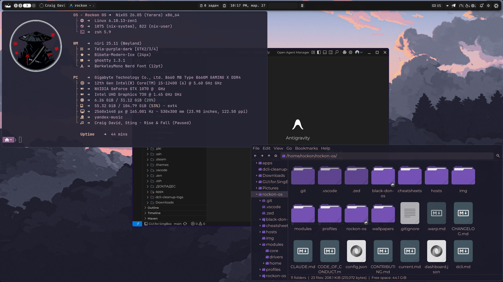

<p align="center">
  
</p>

<h1 align="center">⚡ Rockon OS</h1>

<p align="center">
  <b>A modular, flake-based NixOS configuration built for power users.</b><br/>
  <sub>Niri · Noctalia · NVIDIA-first · Multi-host · Declarative everything.</sub>
</p>

<p align="center">
  <a href="#-quick-start"></a>
  <a href="#-features"></a>
  <a href="#-hardware-profiles"></a>
  <a href="LICENSE"></a>
</p>

---

## 📖 Overview

**Rockon OS** is not a generic starter distro — it's a battle-tested, personal NixOS configuration with a clean multi-host architecture that anyone can fork, adapt, and deploy on their own machines.

The entire system — from GPU drivers and desktop keybinds to shell aliases and startup apps — is declared in Nix and managed through a single flake. One repo, any number of machines, fully reproducible.

> **Lineage:** This project evolved from [ZaneyOS](https://gitlab.com/zaney/zaneyos) → [Black Don OS](https://gitlab.com/theblackdon/black-don-os) → **Rockon OS**.
> Original READMEs are preserved: [`README-ORIGINAL-ZANEYOS.md`](README-ORIGINAL-ZANEYOS.md) · [`README-ORIGINAL-BLACK-DON-OS.md`](README-ORIGINAL-BLACK-DON-OS.md)

---

## ✨ Features

<table>
<tr>
<td width="50%">

### 🖥️ Desktop Stack
- **[Niri](https://github.com/YaLTeR/niri)** — scrollable-tiling Wayland compositor
- **[Noctalia Shell](https://github.com/noctalia-dev/noctalia-shell)** — modern bar & launcher layer
- **[Ghostty](https://ghostty.org)** — GPU-accelerated terminal
- **[Stylix](https://github.com/danth/stylix)** — system-wide theming from a single wallpaper
- **Fuzzel** — fast Wayland app launcher

</td>
<td width="50%">

### 🛠️ Developer Tooling
- **`dcli`** — custom CLI for rebuild, deploy, diagnostics & git
- **[nvf](https://github.com/notashelf/nvf)** — declarative Neovim config
- **Flutter + Android SDK** — dev shell via `nix develop`
- **Doom Emacs** — pre-configured module
- **AI code editors** — optional Claude Code, Gemini CLI, Cursor

</td>
</tr>
<tr>
<td>

### 🎮 Gaming & Media
- **Steam + Gamescope + Proton** — toggle with one flag
- **Niri Gaming Mode** — dedicated fullscreen keybind profile
- **OBS Studio, MPV, Rhythmbox** — media out of the box
- **Yandex Music** — included in packages

</td>
<td>

### 🏗️ Architecture
- **Multi-host flake** — one repo drives N machines
- **Hardware profiles** — plug-and-play GPU configs
- **Per-host overrides** — keybinds, monitors, window rules
- **Modular feature flags** — toggle gaming, productivity, comms
- **Lanzaboote** — Secure Boot support

</td>
</tr>
</table>

---

## 🖼️ The Stack at a Glance

| Layer | Choice |
|---|---|
| **OS** | NixOS 26.05 (Yarara) — `nixos-unstable` |
| **Kernel** | Linux 6.18-zen1 |
| **Compositor** | Niri 25.11 (Wayland) |
| **Shell/Bar** | Noctalia |
| **Terminal** | Ghostty 1.3.1 |
| **Shell** | Zsh 5.9 + Starship prompt |
| **Browser** | Google Chrome (default) |
| **Theme** | Tela-purple-dark icons · Bibata-Modern-Ice cursor |
| **Font** | BerkeleyMono Nerd Font |
| **Auth** | greetd + tuigreet |

---

## 🚀 Quick Start

### Prerequisites

A fresh NixOS installation from the [official ISO](https://nixos.org/download/).

### Installation

```bash
# 1. Enter a shell with required tools
nix-shell -p git pciutils

# 2. Clone the repo
cd ~
git clone https://github.com/RockonWeb/rockon-os.git
cd rockon-os

# 3. Run the interactive installer
./install.sh
```

The installer will walk you through:

| Step | What happens |
|---|---|
| **Hostname** | Creates `hosts/<name>/` with all config files |
| **Username** | Sets up user, git, Home Manager |
| **Timezone & Keyboard** | Written to `variables.nix` |
| **GPU Detection** | Auto-detects GPU → assigns hardware profile |
| **Flake Registration** | Adds your host to `flake.nix` |
| **Build & Switch** | `nixos-rebuild switch` with your new config |

After a reboot, you're running Rockon OS.

---

## 🗂️ Repository Structure

```
rockon-os/
├── flake.nix                  # Flake entrypoint — all hosts defined here
├── install.sh                 # Interactive bootstrap installer
│
├── hosts/
│   ├── default/               # Template for new machines
│   ├── rockon/                # Main host config
│   │   ├── default.nix        #   Host-level NixOS imports
│   │   ├── variables.nix      #   All per-host knobs (browser, GPU, apps…)
│   │   └── hardware.nix       #   Auto-generated hardware config
│   └── nix-test/              # Test host
│
├── modules/
│   ├── core/                  # System-wide NixOS modules
│   │   ├── packages.nix       #   Global packages
│   │   ├── gaming-support.nix #   Steam, Gamescope, controllers
│   │   ├── security.nix       #   Polkit, GNUPG, SSH
│   │   ├── fonts.nix          #   System fonts
│   │   └── ...                #   Boot, networking, services, etc.
│   │
│   ├── drivers/               # GPU & hardware drivers
│   │   ├── nvidia-drivers.nix
│   │   ├── amd-drivers.nix
│   │   ├── intel-drivers.nix
│   │   └── vm-guest-services.nix
│   │
│   └── home/                  # Home Manager modules
│       ├── niri/              #   Niri config (keybinds, layout, window rules)
│       ├── noctalia-shell/    #   Bar/shell (synced via GUI or Nix)
│       ├── scripts/           #   dcli, screenshooting, web-search, etc.
│       ├── editors/           #   Doom Emacs, nvf (Neovim)
│       ├── ghostty.nix        #   Terminal config
│       ├── zsh/               #   Shell config + aliases
│       └── ...                #   40+ individual tool configs
│
├── profiles/                  # Hardware profile entrypoints
│   ├── nvidia/
│   ├── nvidia-laptop/
│   ├── amd/
│   ├── intel/
│   └── vm/
│
└── wallpapers/                # Wallpaper collection for Stylix theming
```

---

## 🎛️ Hardware Profiles

Pick a profile during install — or change it later in `flake.nix`.

| Profile | Use case |
|---|---|
| `nvidia` | Desktop with a dedicated NVIDIA GPU |
| `nvidia-laptop` | Laptop with NVIDIA Optimus (Prime) |
| `amd` | AMD GPU (AMDGPU driver) |
| `intel` | Intel integrated graphics |
| `vm` | Virtual machine (VirtIO / VMware) |

---

## 🔧 Daily Workflow

### `dcli` — The Management CLI

All system operations go through `dcli`:

```bash
# System
dcli rebuild            # Build & switch current host
dcli rebuild-boot       # Build, activate on next reboot
dcli update             # Update flake inputs + rebuild

# Multi-host
dcli build <host>       # Build a specific host (no activation)
dcli deploy <host>      # Build & switch to a specific host
dcli list-hosts         # Show all configured hosts

# Maintenance
dcli cleanup            # Remove old generations
dcli diag               # Generate ~/diag.txt system report
dcli trim               # Run fstrim for SSD health

# Git shortcuts
dcli commit "message"   # Stage all + commit
dcli push / pull        # Sync with origin
dcli status             # git status
```

**Shell aliases** for the impatient:

| Alias | Expands to |
|---|---|
| `fr` | `dcli rebuild` |
| `fu` | `dcli update` |

---

## ⌨️ Key Bindings

### Niri (Desktop)

| Shortcut | Action |
|---|---|
| `Mod + Space` | Noctalia launcher |
| `Mod + Y` | Fuzzel fallback launcher |
| `Mod + Shift + V` | Clipboard history picker |

### Ghostty (Terminal)

| Shortcut | Action |
|---|---|
| `Alt + S, Q` | Quick terminal |
| `Alt + S, P` | Command palette |
| `Alt + S, U` | Jump to previous prompt |
| `Alt + S, W` | Open scrollback in temp file |

---

## ⚙️ Customization

Almost all per-host tuning lives in a single file:

```
hosts/<your-host>/variables.nix
```

### Core Settings

```nix
browser      = "google-chrome";   # Default browser
terminal     = "ghostty";         # Default terminal
defaultShell = "zsh";             # "zsh" or "fish"
barChoice    = "noctalia";        # "noctalia" or "dms"
timeZone     = "Asia/Irkutsk";
```

### Feature Flags

Enable or disable entire feature groups with a single boolean:

```nix
gamingSupportEnable    = true;    # Steam, Gamescope, ProtonUp, controllers
enableCommunicationApps = true;  # Discord, Teams, Zoom, Telegram
enableProductivityApps  = true;  # Obsidian, GNOME Boxes, QuickEmu
enableExtraBrowsers     = true;  # Vivaldi, Brave, Firefox, Chromium
aiCodeEditorsEnable     = true;  # Claude Code, Gemini CLI, Cursor
flutterdevEnable        = true;  # Flutter + Android SDK dev shell
```

### Monitors

```nix
extraMonitorSettings = ''
  monitor=DP-2,2560x1440@165.001,0x0,1.25
'';
```

### Startup Apps

```nix
startupApps = [
  "Telegram"
  "vesktop"
];
```

### Theming

```nix
stylixImage = ../../wallpapers/Valley.jpg;   # Stylix generates palette from this
```

After any change:

```bash
dcli rebuild
```

---

## 📍 Where Things Live

A quick map for when you need to change something specific:

| What you want to change | Where to look |
|---|---|
| Per-host settings (browser, GPU, apps) | `hosts/<host>/variables.nix` |
| Host NixOS imports & services | `hosts/<host>/default.nix` |
| Niri keybinds (shared) | `modules/home/niri/keybinds.nix` |
| Niri keybinds (per-host) | `modules/home/niri/hosts/<host>/` |
| XDG defaults & file associations | `modules/home/xdg.nix` |
| `dcli` implementation | `modules/home/scripts/dcli.nix` |
| Global system packages | `modules/core/packages.nix` |
| Gaming support config | `modules/core/gaming-support.nix` |
| GPU driver settings | `modules/drivers/` |

---

## 🧩 Development Shell

The flake includes a pre-configured Flutter + Android development environment:

```bash
nix develop
```

This drops you into a shell with `flutter`, `android-sdk`, and `jdk11` ready to go — no system-level installation needed.

---

## 📝 Additional Documentation

| Document | Description |
|---|---|
| [`dcli.md`](dcli.md) | Full `dcli` reference manual |
| [`FAQ.md`](FAQ.md) | Frequently asked questions |
| [`TROUBLESHOOTING.md`](TROUBLESHOOTING.md) | Common issues and fixes |
| [`CHANGELOG.md`](CHANGELOG.md) | Version history and release notes |
| [`CONTRIBUTING.md`](CONTRIBUTING.md) | Contribution guidelines |

---

## 📌 Notes

- The repo is expected to live at **`~/rockon-os`**. Some modules and helper scripts contain hardcoded paths to this location.
- Legacy `zaneyos` references still exist in parts of the tree — these will be cleaned up in a future pass.
- Hyprland modules are still present in the repo but are **not enabled by default**. Niri is the active compositor.

---

## 🤝 Credits & Upstream

This project stands on the shoulders of:

- **[ZaneyOS](https://gitlab.com/zaney/zaneyos)** by Tyler Kelley — the original foundation
- **[Black Don OS](https://gitlab.com/theblackdon/black-don-os)** by Black Don — multi-host architecture & NVIDIA focus
- **[Niri](https://github.com/YaLTeR/niri)** · **[Noctalia](https://github.com/noctalia-dev/noctalia-shell)** · **[Stylix](https://github.com/danth/stylix)** · **[nvf](https://github.com/notashelf/nvf)** — the tools that make this desktop tick

---

<p align="center">
  <sub>MIT License © 2026 RockonWeb</sub><br/>
  <a href="https://github.com/RockonWeb/rockon-os">
    
  </a>
</p>
